# Домашнее задание к занятию 10 «Jenkins»

## Подготовка к выполнению

1. Создать два VM: для jenkins-master и jenkins-agent.
2. Установить Jenkins при помощи playbook.
3. Запустить и проверить работоспособность.
4. Сделать первоначальную настройку.

## Основная часть

1. Сделать Freestyle Job, который будет запускать `molecule test` из любого вашего репозитория с ролью.

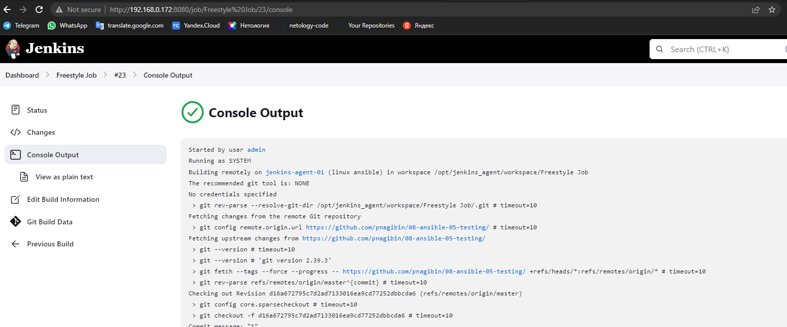


2. Сделать Declarative Pipeline Job, который будет запускать `molecule test` из любого вашего репозитория с ролью.

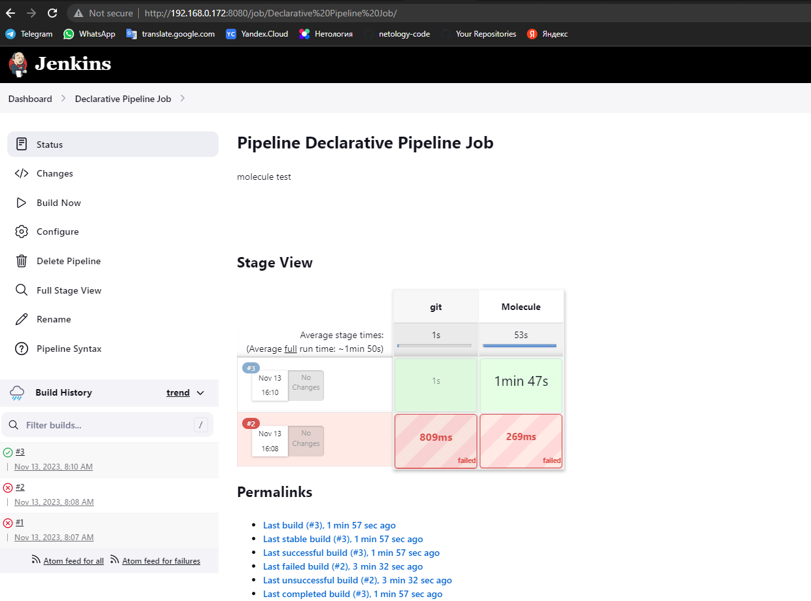

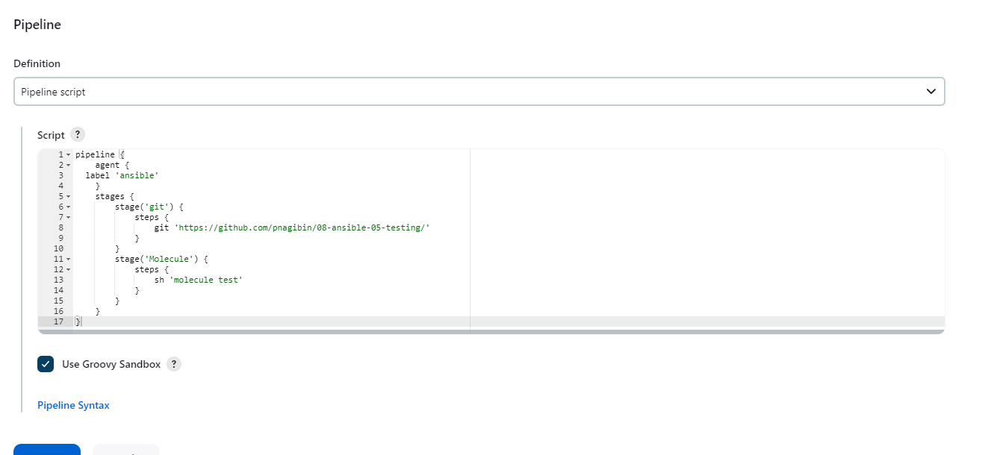

```
pipeline {
    agent {
  label 'ansible'
    }
    stages {
        stage('git') {
            steps {
                git 'https://github.com/pnagibin/08-ansible-05-testing/'
            } 
        }
        stage('Molecule') {
            steps {
                sh 'molecule test'
            } 
        }
    }
}
```

3. Перенести Declarative Pipeline в репозиторий в файл `Jenkinsfile`.

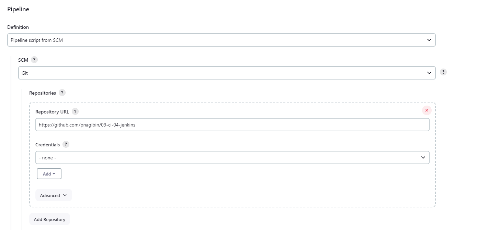

Jenkinsfile
```
https://github.com/pnagibin/09-ci-04-jenkins/blob/master/pipeline/DeclarativePipeline
```
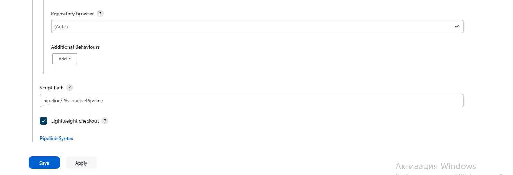

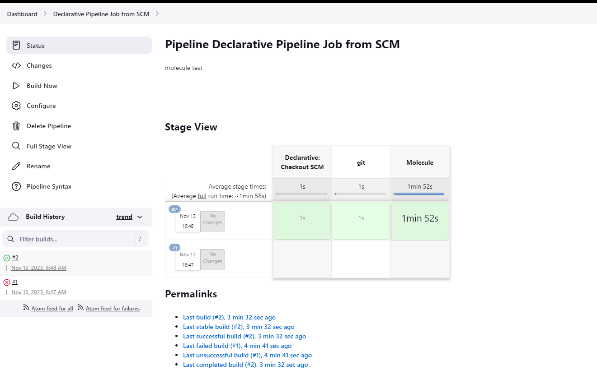

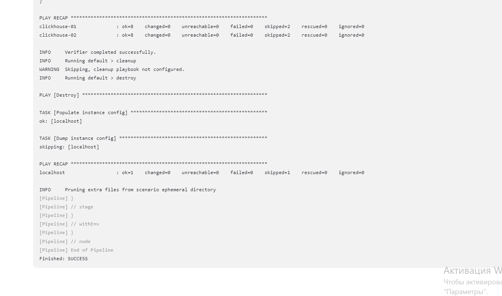

4. Создать Multibranch Pipeline на запуск `Jenkinsfile` из репозитория.

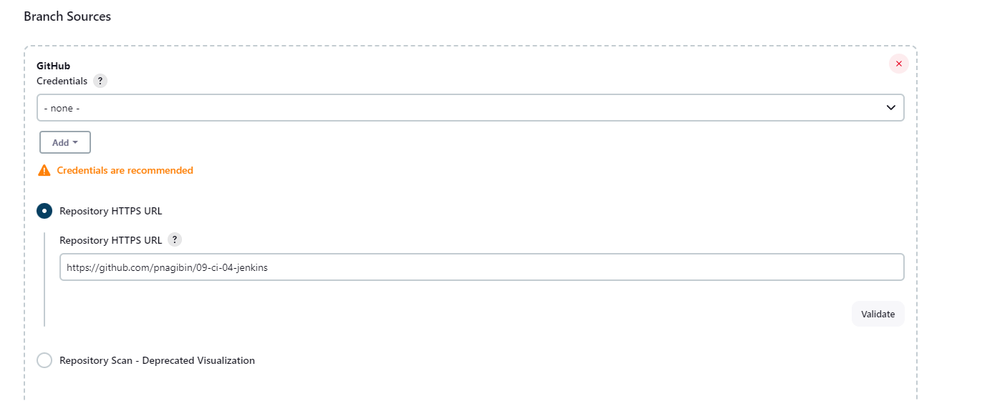


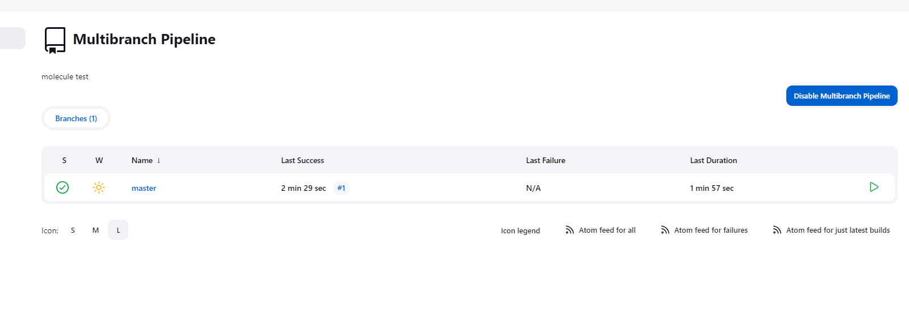

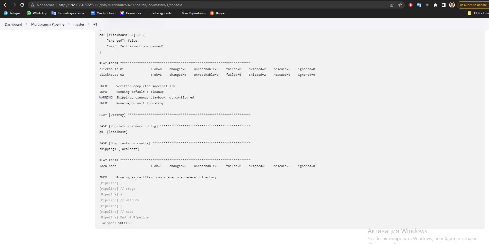

5. Создать Scripted Pipeline, наполнить его скриптом из [pipeline](./pipeline).

Снова ошибки от автора модуля.
Идея понятна, должна былазапуститься его playbook из его же репозитория, но точно тоже самое я сделал в п.2.

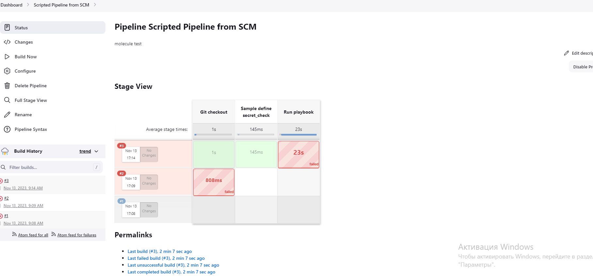

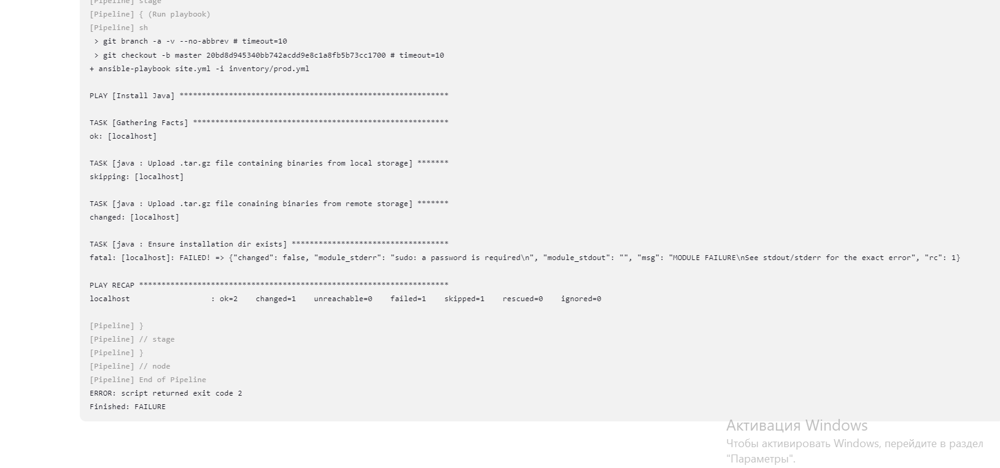

6. Внести необходимые изменения, чтобы Pipeline запускал `ansible-playbook` без флагов `--check --diff`, если не установлен параметр при запуске джобы (prod_run = True). По умолчанию параметр имеет значение False и запускает прогон с флагами `--check --diff`.

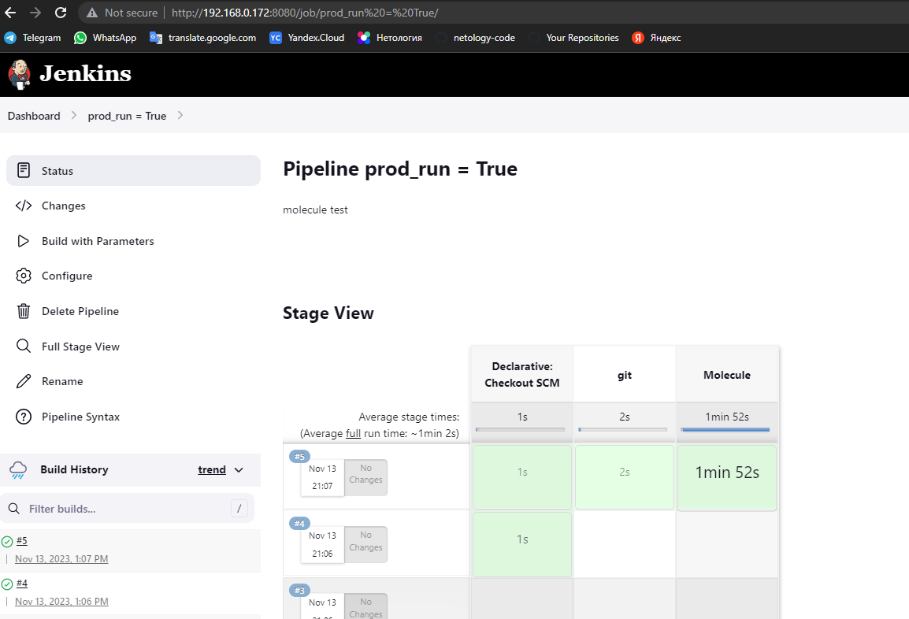

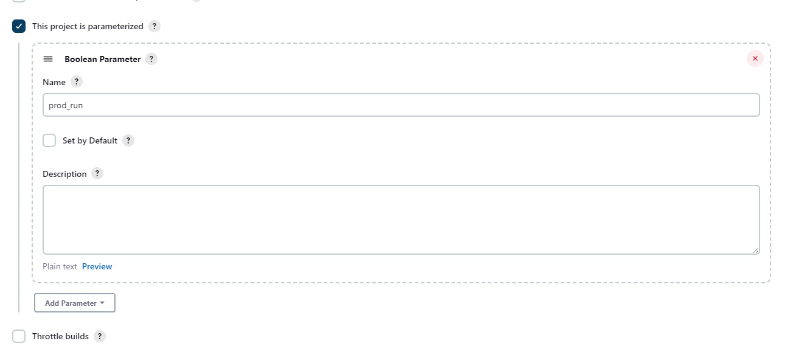

```
pipeline {
    agent {
  label 'ansible'
    }
    stages {
        stage('git') {
            when { expression { return params.prod_run } }
            steps {
                git 'https://github.com/pnagibin/08-ansible-05-testing/'
            } 
        }
        stage('Molecule') {
            when { expression { return params.prod_run } }
            steps {
                sh 'molecule test'
            } 
        }
    }
}
```

7. Проверить работоспособность, исправить ошибки, исправленный Pipeline вложить в репозиторий в файл `ScriptedJenkinsfile`.

Я оформил несколько Jenkins файлов:

```
https://github.com/pnagibin/09-ci-04-jenkins/blob/master/pipeline/DeclarativePipeline
https://github.com/pnagibin/09-ci-04-jenkins/blob/master/pipeline/Jenkinsfile
https://github.com/pnagibin/09-ci-04-jenkins/blob/master/pipeline/prod_run
```

8. Отправить ссылку на репозиторий с ролью и Declarative Pipeline и Scripted Pipeline.

```
https://github.com/pnagibin/08-ansible-05-testing - Роль
https://github.com/pnagibin/09-ci-04-jenkins - Pipeline
```
9.  Сопроводите процесс настройки скриншотами для каждого пункта задания!!

## Необязательная часть

1. Создать скрипт на groovy, который будет собирать все Job, завершившиеся хотя бы раз неуспешно. Добавить скрипт в репозиторий с решением и названием `AllJobFailure.groovy`.
2. Создать Scripted Pipeline так, чтобы он мог сначала запустить через Yandex Cloud CLI необходимое количество инстансов, прописать их в инвентори плейбука и после этого запускать плейбук. Мы должны при нажатии кнопки получить готовую к использованию систему.

---

### Как оформить решение задания

Выполненное домашнее задание пришлите в виде ссылки на .md-файл в вашем репозитории.

---
